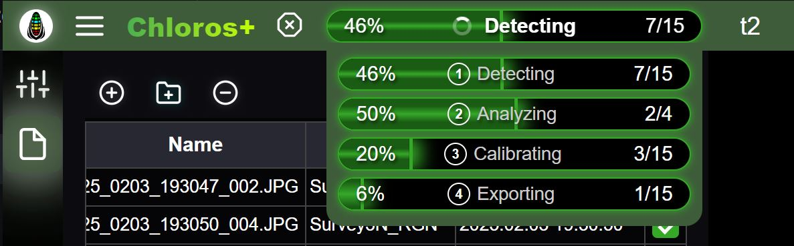

# Getting Started

<figure><figcaption></figcaption></figure>

Chloros is a software application from [MAPIR](https://www.mapir.camera) to process images and other sensor data.

***

Chloros is available in 4 application modes:

## Chloros: Desktop GUI application

\[Recommended] Standalone separate window with all features.

## Chloros (Browser): Web-based GUI interface

Runs in your web browser (Chrome/Edge). Best for slower computers with <4GB VRAM.

## [Chloros CLI: Command line interface](CLI.md)

Command-line batch processing. Perfect for automation, scripting, and advanced workflows. _CLI requires a Chloros+ license to access._

## [Chloros API: Python SDK](api-python-sdk.md)

Programmatic Python interface for automation and custom workflows. Perfect for research pipelines, integration with existing Python applications, and building custom tools. _API requires a Chloros+ license to access._

***

## Chloros+

While Chloros is free to use for most tasks, you may find you want more. That is where a paid license for Chloros+ can benefit you. With a Chloros+ license you can unlock new features such as:

* **Multi-threaded Processing**: greatly speed up image processing for larger projects by simultaneously processing images through the pipeline.
* **GPU (CUDA) Acceleration**: take advantage of today's higher GPU memory options to further speed up the image processing pipeline. We recommend 4GB or more of VRAM for best results.
* **Chloros+** [**CLI**](CLI.md) **Access**: run Chloros+ from the command line to automate and integrate into your own software.
* **Chloros+** [**API**](api-python-sdk.md) **Access:** run Chloros+ from Python for programmatic control, enabling seamless integration with your research pipelines, data analysis workflows, and custom applications.
* **Multiple Device Usage**: each Chloros+ license allows for 2+ devices to be registered. Use your MAPIR Cloud account to manage registered devices. Add support for more devices by upgrading your Chloros+ license.
* **Custom Multispectral Index Formulas:** enter in custom multispectral indices in the Chloros raster calculators, both for processing and the image viewing sandbox.

<a href="https://cloud.mapir.camera/pricing" class="button primary" data-icon="envira">Chloros+ Pricing &#x26; Signup</a>

<figure><figcaption></figcaption></figure>

<figure><figcaption></figcaption></figure>
