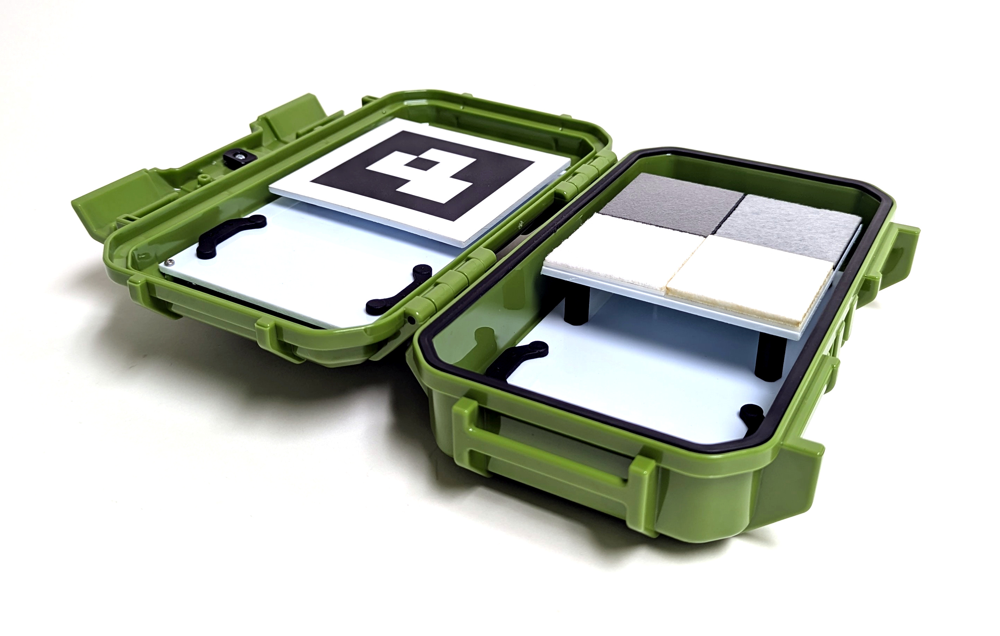
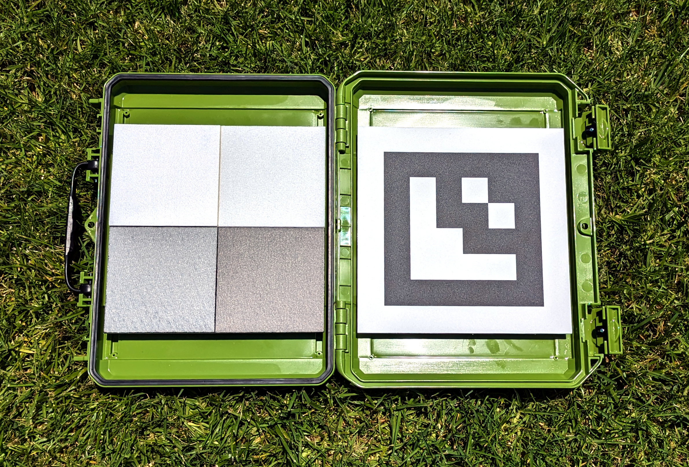
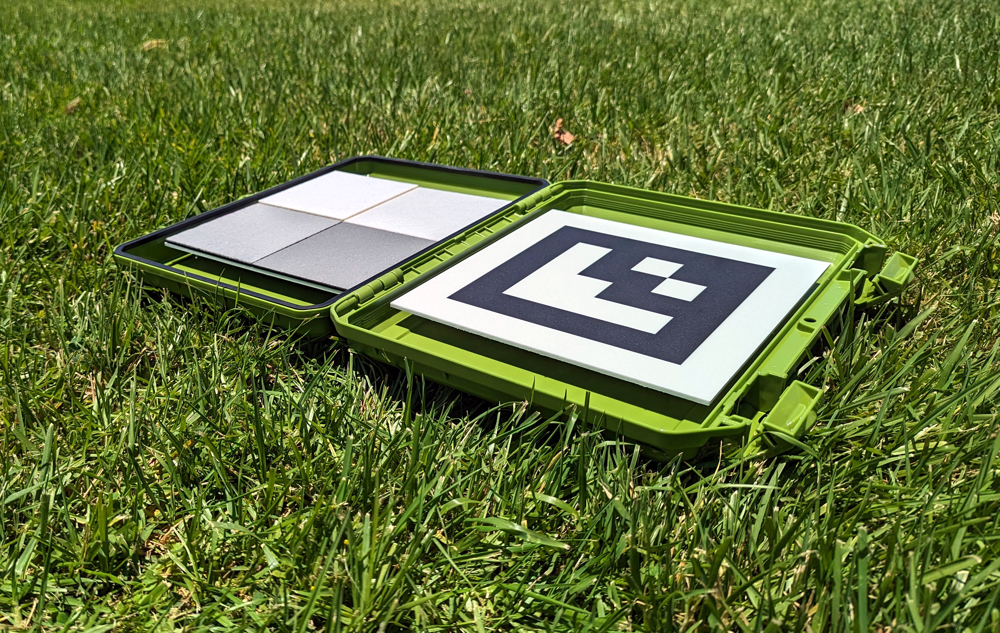
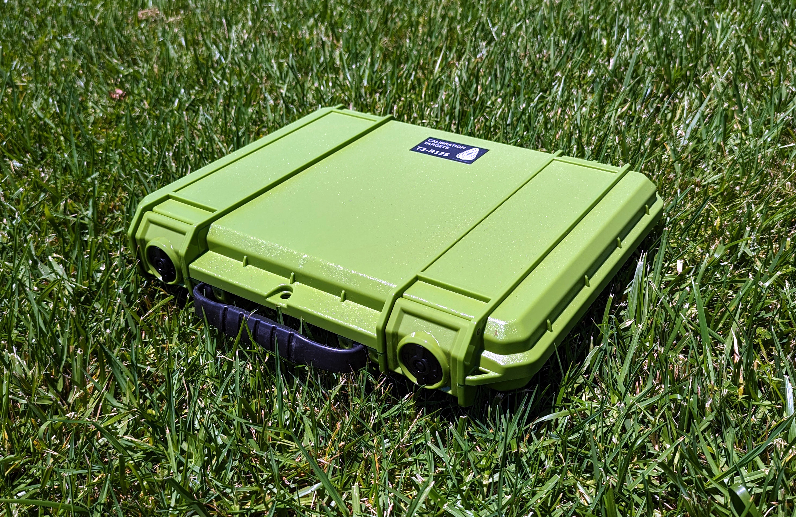

# 校准靶标

MAPIR提供多种校准靶标以满足不同应用需求。下图所示的紧凑型T4-R50包含4块面板，其光反射率已在250-2500纳米波长范围内完成测量。

<figure><figcaption>
MAPIR T4-R50
</figcaption></figure>

T4漫反射参考靶具有以下反射率曲线，[数据下载链接](https://cdn.shopify.com/s/files/1/0972/5566/files/MAPIR_Diffuse_Reflectance_Standard_Calibration_Target_Data_T4.xlsx?v=1741759157)：

<figure><figcaption>
MAPIR T4 反射率 :: 250-2500nm
</figcaption></figure>

<figure><figcaption>
MAPIR T4反射率 :: 400-1000nm
</figcaption></figure>观察反射率曲线可知，横轴为波长，纵轴为反射率百分比。当我们拍摄校准靶标图像时，便会在相机传感器各波段敏感的频谱范围内，建立像素值与反射率百分比之间的对应关系。

这意味着使用我们的相机拍摄的每张图像，均可通过[T4-R50](https://www.mapir.camera/collections/calibration-targets/products/diffuse-reflectance-standard-calibration-target-package-t3-r50)或[T4-R125](https://www.mapir.camera/collections/multispectral-reflectance-reference-calibration-targets/products/diffuse-reflectance-standard-calibration-target-package-t4-r125)等反射率目标照片进行反射率校准。 校准后，图像中每个像素值即代表百分比反射率。

若将校准后的图像以Chloros（典型JPG格式）或TIFF输出，则反射率百分比通过像素值除以图像格式位深度计算得出：JPG格式除以255，TIFF格式除以65,535。 您也可选择Chloros的PERCENT格式输出，此时每个像素值将呈现0.0至1.0的百分比范围（即0%至100%反射率）。需注意部分图像应用程序无法处理百分比（浮点数）图像，且此类图像存储占用较大空间。

<figure><figcaption>
T4-R125
</figcaption></figure> <figure><figcaption>
T4-R125
</figcaption></figure> <figure><figcaption>
T4-R125
</figcaption></figure>

