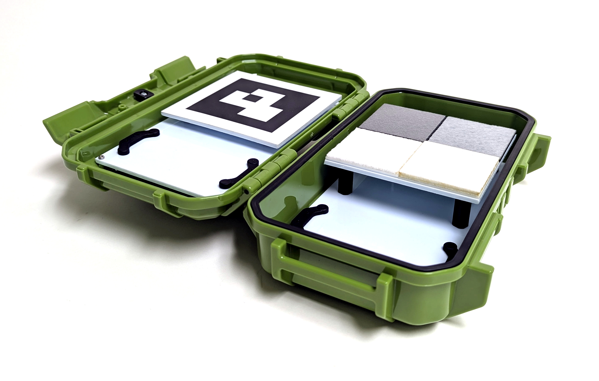
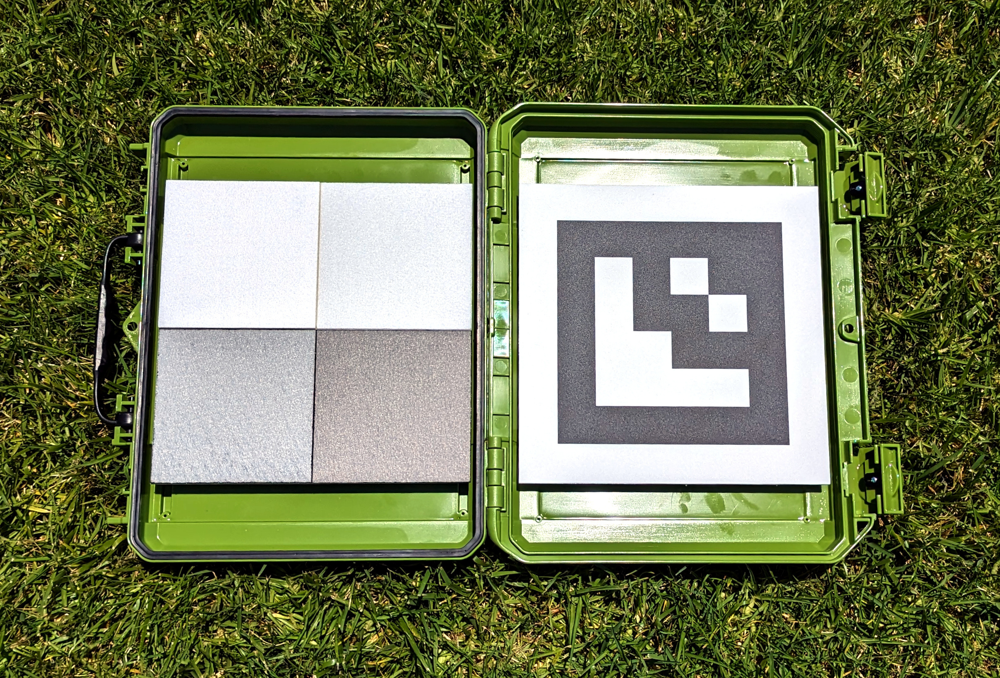

# 校准靶

MAPIR 提供多种校准靶，以满足各类应用需求。下图所示的紧凑型 T4-R50 包含 4 个面板，其光反射率已在 250 至 2,500 nm 波长范围内经过测量。

<figure><figcaption>
MAPIR T4-R50
</figcaption></figure>T4 漫反射参考靶的反射率曲线如下，[点击此处下载数据](https://cdn.shopify.com/s/files/1/0972/5566/files/MAPIR_Diffuse_Reflectance_Standard_Calibration_Target_Data_T4.xlsx?v=1741759157)：

<figure><figcaption>
MAPIR T4 反射率 :: 250-2500nm
</figcaption></figure>

<figure><figcaption>
MAPIR T4 反射率 :: 400-1000nm
</figcaption></figure>T4P 漫反射参考靶的反射率曲线如下，[数据下载请点击此处](https://cdn.shopify.com/s/files/1/0972/5566/files/MAPIR_Diffuse_Reflectance_Standard_Calibration_Target_Data_T4.xlsx?v=1741759157)：

<figure><figcaption>
MAPIR T4P 反射率 :: 250-2500nm
</figcaption></figure>

<figure><figcaption>
MAPIR T4P 反射率 :: 400-1000nm
</figcaption></figure>观察反射率图表可知，其坐标轴分别表示波长（x 轴）与反射率百分比（y 轴）。当我们拍摄校准靶的图像时，便会在相机各传感器波段所敏感的光谱范围内，建立像素值与反射率百分比之间的对应关系。

这意味着，使用我们的相机拍摄的每一张图像，您都可以利用我们的反射率标靶照片（例如 [T4-R50](https://www.mapir.camera/collections/calibration-targets/products/diffuse-reflectance-standard-calibration-target-package-t3-r50) 或 [T4-R125](https://www.mapir.camera/collections/multispectral-reflectance-reference-calibration-targets/products/diffuse-reflectance-standard-calibration-target-package-t4-r125)）对图像进行反射率校准。 校准完成后，图像中的每个像素值即等同于相应的反射率百分比。

如果您将 Chloros 中的校准图像导出为常见的 JPG 或 TIFF 格式，则反射率百分比是通过将像素值除以图像格式的位深度来计算的。因此，对于 JPG 格式，除以 255；对于 TIFF 格式，除以 65,535。 您也可以选择以 PERCENT 格式输出（如 Chloros），此时每个像素的百分比值范围为 0.0 到 1.0（即 0% 到 100% 的反射率）。请注意，某些图像应用程序无法处理百分比（浮点）格式的图像，且此类图像在存储方面体积较大。

<figure><figcaption>
T4-R125
</figcaption></figure> <figure><figcaption>
T4-R125
</figcaption></figure> <figure><figcaption>
T4-R125
</figcaption></figure>

