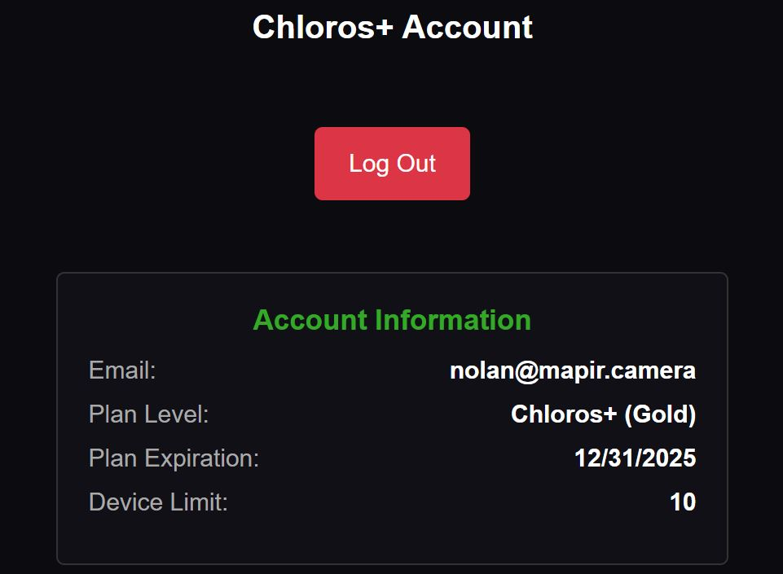

# Chloros+ Login

## Chloros and Chloros (Browser) Login

The user  sidebar menu allows you to log into your Chloros+ account and unlock additional features.

When logged in your account details will be shown:

<figure><figcaption></figcaption></figure>

## CLI Login

Login with your Chloros+ credentials to enable CLI processing.

**Syntax:**

```bash
chloros-cli login <email> <password>
```

**Example:**

```powershell
chloros-cli login user@example.com 'MyP@ssw0rd123'
```


**Special Characters**: Use single quotes around passwords containing characters like `$`, `!`, or spaces.


**Output:**

<figure><figcaption></figcaption></figure>

### Plan Expiration

The plan expiration in the GUI shows when your license will become invalid. For recurring monthly subscriptions the expiration is at the end of the month. For yearly subscriptions it is a year after you started the subscription. The license check requires a monthly internet connection to verify, with a 30 day grace period.

### Device Limit

Each Chloros+ plan offers a different number of registered devices. Each device you log into with a Chloros+ account will count towards your number of registered devices. You can rename and remove a device on your MAPIR Cloud account page.

<table><thead><tr><th width="168.5999755859375" align="right">Chloros+ Plan</th><th align="center">COPPER</th><th align="center">BRONZE</th><th align="center">SILVER</th><th align="center">GOLD</th></tr></thead><tbody><tr><td align="right">Devices Supported</td><td align="center">2</td><td align="center">2</td><td align="center">5</td><td align="center">10</td></tr></tbody></table>
