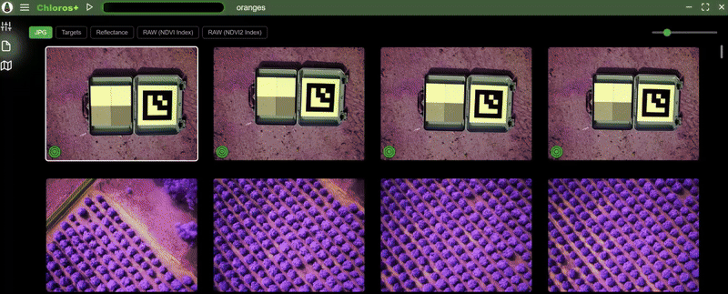

# 图片网格

将图片导入项目后，您将在主区域看到图片以网格形式排列。

## 缩略图尺寸

可通过右上角的缩放滑块调整图片缩略图尺寸，也可按住Ctrl键配合鼠标滚轮进行缩放。

<figure><figcaption></figcaption></figure>## 导出视图按钮

随着图像处理进度，网格区域左上角将显示按钮。这些按钮可切换网格缩略图的图像类型：

* **JPG** - 相机原始JPG缩略图
* **目标** - 包含检测校准目标的图像
* **反射率** - 经校准的反射率图像
* **RWA（指数/LUT）** - 带彩色LUT渐变的多光谱指数图像

点击图像网格缩略图将打开全屏[图像查看器](opening-an-image-full-screen.md)。若网格查看模式设置为特定导出类型（如&quot;目标图像&quot;），点击网格缩略图将直接全屏显示导出的目标图像。

<figure><figcaption></figcaption></figure>
