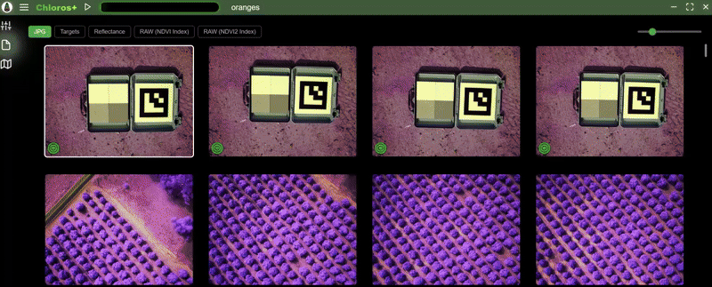

# 图片网格

将图片导入项目后，您将在主区域看到图片以网格形式排列。

## 缩略图大小

您可以使用右上角的缩放滑块来调整图片缩略图的大小。您也可以按住 CTRL 键并滚动鼠标滚轮来调整缩略图大小。

<figure><figcaption></figcaption></figure>## 导出视图按钮

随着图像的处理，网格区域左上角会出现一些按钮。这些按钮可在不同图像类型之间切换网格缩略图：

* **JPG** - 原始相机 JPG 缩略图
* **校准目标** - 包含已检测校准目标的图像
* **反射率** - 已校准的反射率图像
* **RWA (指数/LUT)** - 带有彩色 LUT 渐变的计算多光谱指数图像

点击图像网格缩略图将打开全屏 [图像查看器](opening-an-image-full-screen.md)。如果网格的查看模式设置为特定导出类型（如“目标”），点击网格缩略图将全屏打开导出的目标图像。

<figure><figcaption></figcaption></figure>
