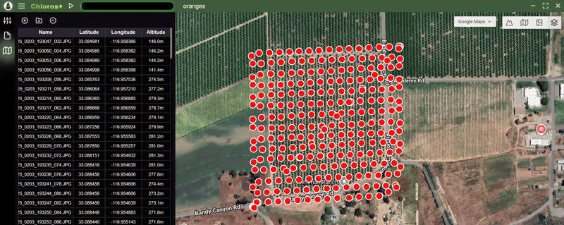

# 地图标记

地图选项卡会根据图像的GPS坐标，在交互式二维地图上显示您的图像。这为您提供拍摄会话的地理概览，并帮助您可视化空间覆盖范围。在首次导入图像时，此功能还可快速移除无需处理的图像。

<figure><figcaption></figcaption></figure>

## 访问地图标签页

1. 在Chloros中打开或创建项目
2. 导入含GPS元数据的图像
3. 点击左侧边栏的**地图**  标签页
4. 地图将显示每张图像GPS位置的标记


**GPS必备条件**：仅EXIF元数据中嵌有GPS坐标的图像会显示在地图上。拍摄时请确保相机GPS功能处于开启状态。


***

## 通过地图标签调整图像

**地图**  标签页具备相同的添加       和删除    文件按钮与[**文件浏览器**](../processing-images-gui/adding-files-to-a-project.md)  标签页相同。同时显示相同的项目文件表格列表，但列标题有所不同：

### 文件名

* 相机原始文件名
* 保持相机命名规范（例如：IMG\_0001.RAW）

### 纬度

* 图像纬度

### 经度

* 图像经度

### 海拔

* 图像拍摄海拔高度


点击表格列标题可对行数据进行排序


***

## 图像标记

每张带有GPS数据的图像在地图上均以标记显示：

### 标记显示

* 标记显示每张图像的精确GPS坐标位置
* 缩小地图时，聚集的标记可能显示为聚合状态
* 放大地图可查看单个图像位置


超级缩放：当达到地图瓦片提供商的最大缩放级别后，继续放大时瓦片将被放大，从而显示紧密相邻的标记。


### 悬停预览

* **将鼠标悬停**于任意标记点可查看图像缩略图
* 无需离开地图视图即可快速视觉识别
* 适用于在大型拍摄任务中定位特定图像

***

## 地图瓦片提供商


**自动选择**：Chloros会自动为当前地图位置选择最佳缩放级别的图块服务。您可根据需要手动切换提供商。


地图选项卡支持两种背景地图图像的图块提供商：

### Google地图

* 来自Google的标准卫星及地图影像
* 全球覆盖范围最优

### ESRI

* 来自ESRI ArcGIS的卫星及航拍影像
* 特定区域常提供更高分辨率影像

***

## 地图瓦片类型

可选择地图图层类型（从左至右）：

 ### 地形图

显示海拔剖面图及包含细节（道路等）的地图瓦片

### 地图

显示标准（低带宽）地图瓦片及细节（道路等）

### 卫星图

显示精细（高带宽）卫星地图瓦片

### 混合图

显示卫星地图瓦片并叠加细节（道路等）

***

## 地图导航

### 缩放控制

* **缩放**：使用鼠标滚轮或缩放按钮
* **全屏**：将地图全屏显示

### 平移控制

* **平移**：点击并拖动以移动地图视图

***

## 应用场景

### 飞行路径可视化

* 查看无人机拍摄任务的覆盖区域
* 识别影像覆盖的空白区域
* 验证飞行路径执行情况

### 地面勘测复核

* 查看地面拍摄点的空间分布
* 定位校准目标影像在勘测区域中的位置
* 规划补充拍摄点

### 质量控制

* 快速识别异常位置拍摄的图像
* 验证数据集GPS定位精度
* 通过现场记录交叉核对图像位置

***

## 故障排除

### 标记点未显示

**可能原因：**

* 图像未包含GPS元数据
* 拍摄时相机GPS功能未启用
* EXIF数据被外部软件移除

**解决方案：**确认相机GPS功能开启状态，重新导入原始文件

### 标记位置错误

**可能原因：**

* 相机GPS卫星定位精度不足
* 拍摄过程中GPS漂移

**解决方案：**此问题通常源于拍摄时段因素；精密应用场景建议采用PPK/RTK GPS技术
