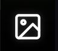

# Opening an Image Full Screen

The Chloros Image Viewer provides a dedicated full-screen interface for viewing, analyzing, and manipulating your multispectral images. Whether viewing original images or processed outputs, the Image Viewer offers powerful tools for inspection and analysis.

## Accessing the Image Viewer

### From the File Browser

The most common way to open an image in the Image Viewer:

1. Ensure you're in the **File Browser** tab 
2. Click any **image thumbnail** in the image grid
3. The image opens in the **main preview area** (center of screen)
4. The image is now loaded and ready for full-screen viewing

### Opening the Image Viewer Tab

Once an image is loaded in the preview area:

1. Click the **Image Viewer**  icon in the left sidebar
2. The Image Viewer tab opens, displaying the selected image full-screen
3. Advanced viewing and analysis tools become available in the left sidebar

***

## Image Viewer Interface Overview

### Main Display Area

The largest portion of the screen shows your image:

* **Full resolution**: Images displayed at native resolution
* **Zoomable**: Use controls or mouse wheel to zoom
* **Pannable**: Click and drag to move around when zoomed
* **Aspect ratio maintained**: Images scale proportionally

***

## Viewing Options

### Basic Image Navigation

#### Browse Through Images

Navigate through your image set using keyboard shortcuts or buttons:

* **Next image**: Click → button or press **→** (Right Arrow) key
* **Previous image**: Click ← button or press **←** (Left Arrow) key
* **Jump to specific image**: Return to File Browser and click desired thumbnail

#### Zoom Controls

Adjust magnification to inspect image details:

**Zoom In:**

* Click **+** (Plus) button
* Press **+** or **=** key
* Scroll mouse wheel **up**

**Zoom Out:**

* Click **−** (Minus) button
* Press **−** (Minus) key
* Scroll mouse wheel **down**

**Fit to Screen:**

* Click **↔** (Fit) button
* Press **0** (Zero) key
* Double-click on image

#### Pan When Zoomed

When zoomed in beyond screen size:

1. Move mouse cursor over image
2. Click and **hold left mouse button**
3. **Drag** to move image around
4. Release to stop panning

**Alternative**: Use arrow keys to pan in small increments

***

## Pixel Value Inspection

### Viewing Pixel Values at Cursor

As you move your mouse cursor over the image, pixel values display in real-time:

**Value display location:**

* **Floating number and red line in right side index LUT gradient legend**
* **When zoomed in further, floating value near cursor and highlighted pixel**
* Shows values for pixel **under cursor or highlighted**
* Updates as you move mouse

***

## Image Types You Can View

### Original Images (Pre-Processing)

**RAW + JPG images from camera:**

* Display RAW data as previewed
* Show original, uncorrected values
* Useful for checking image quality before processing

### Calibrated Reflectance Images

**After processing:**

* Vignette corrected
* Reflectance calibrated
* Multi-band TIFF (Red, Green, NIR, etc.)
* Scientific data ready for analysis

### Index Images

**NDVI, NDRE, GNDVI, etc. (\_NDVI.tif files):**

* Single-band grayscale images
* Pixel values represent index calculation results
* Range typically -1 to +1 for normalized indices
* Can apply color LUTs for visualization

***

## Index and LUT Application

Apply multispectral indices and color Look-Up Tables:

1. Locate **Index/LUT Sandbox** in **Image Viewer**  sidebar
2. Select vegetation index (NDVI, NDRE, etc.)
3. Select multispectral formula, or create your own custom one (Chloros+ only)
4. Apply color LUT gradient for visualization
5. Adjust value ranges and thresholds

See [Index/LUT Sandbox](index-lut-sandbox.md) for detailed instructions.

***

## Keyboard Shortcuts

### Navigation

* **→** (Right Arrow): Next image
* **←** (Left Arrow): Previous image
* **Home**: First image in list
* **End**: Last image in list

### Zoom

* **+** or **=**: Zoom in
* **−**: Zoom out
* **0** (Zero): Fit to screen
* **Mouse Wheel**: Zoom in/out

### View Controls

* **P**: Toggle pixel percent mode
* **L**: Toggle layers panel
* **Esc**: Close full-screen or return to File Browser

### Other

* **Ctrl+S**: Save current image
* **F**: Full-screen mode (if available)

***

### Verifying Index Calculations

Check that indices calculated correctly:

1. Open NDVI or other index image
2. Check vegetation areas:
   * **NDVI**: Should show 0.4-0.9 for healthy plants
   * **NDRE**: Higher values for vigorous growth
   * **GNDVI**: Similar to NDVI but chlorophyll-sensitive
3. Check non-vegetation:
   * **Soil**: Near 0 or slightly negative
   * **Water**: Negative values (-0.5 to 0)

***

## Troubleshooting Viewing Issues

### Image Won't Open

**Possible causes:**

* File corrupted during processing
* Unsupported file format
* Insufficient memory for large image

**Solutions:**

1. Try opening in external viewer to verify file integrity
2. Check file format matches expected type
3. Close other applications to free memory
4. Try smaller/different image

### Black or White Image Display

**Possible causes:**

* Value range outside display capability
* 32-bit float image with unusual values
* Index calculation error

**Solutions:**

1. Check pixel values - if all very low or very high, adjust display range
2. Try opening in QGIS or similar with auto-range adjustment
3. Check Debug Log from processing for errors

### Pixel Values Seem Wrong

**Possible causes:**

* Viewing wrong image (original vs processed)
* Calibration didn't apply correctly
* Light sensor data wasn't included in input
* Percent mode toggled incorrectly

**Solutions:**

1. Verify you're viewing processed output (check filename suffix)
2. Check percent mode button state
3. Compare with known-good images from same dataset

***

## Next Steps

Now that you can view images full-screen:

* [**Image Layers**](image-layers.md) - Learn about multi-band visualization
* [**Index/LUT Sandbox**](index-lut-sandbox.md) - Apply custom indices and color mapping
* [**Multispectral Index Formulas**](../project-settings/multispectral-index-formulas.md) - Understand available indices

For processing workflow, see:

* [**Processing Images (GUI)**](../processing-images-gui/page-1.md) - Complete processing guide
