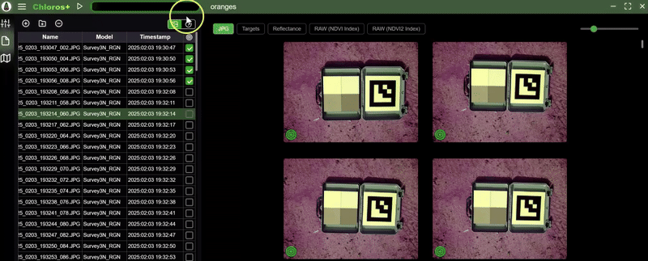

# 向项目添加文件

在Chloros中创建或打开项目后，下一步需添加多光谱图像以开始处理。文件浏览器 标签页可轻松导入图像并管理数据集。

## 访问文件浏览器

1. 在Chloros中打开或创建项目
2. 点击左侧边栏的**文件浏览器**  图标
3. 文件浏览器面板将显示项目文件列表


**支持文件类型**：Chloros支持MAPIR、Survey3W及Survey3N相机的RAW+JPG与JPG图像文件。仅推荐使用RAW+JPG格式。


***

## 向项目添加图像

向项目添加图像主要有两种方式：

### 方法1：添加文件

此选项用于导入单个图像文件或少量文件。

1. 点击文件浏览器面板顶部的**&quot;添加文件&quot;**  按钮
2. 导航至图像所在文件夹
3. 选择一个或多个图像文件（按住**Ctrl**键可多选）
4. 点击**&quot;打开&quot;**导入选定文件

### 方法二：添加文件夹

此选项可一次性导入文件夹内所有图像。

1. 点击文件浏览器面板顶部的**&quot;添加文件夹&quot;**  按钮
2. 导航至并选择包含拍摄会话图片的文件夹
3. 点击**&quot;选择文件夹&quot;**导入该文件夹内所有支持的图片

***

## 文件浏览器表格说明

图片导入后将显示在表格中，包含以下列：

### 文件名

* 相机原始文件名
* 保持相机命名规范（例如：IMG\_0001.RAW）

### 时间戳

* 图像拍摄日期与时间
* 提取自图像EXIF元数据
* 用于PPK同步与标靶检测

### 相机型号

* 自动检测的相机及滤镜配置
* 示例：Survey3W\_RGN, Survey3N\_OCN, Survey3W\_RGB
* 用于应用正确的处理配置文件

### 目标列（复选框）

* 勾选此框可识别含校准目标的图像
* 显著提升处理过程中的目标检测速度
* 详情参见[目标图像选择指南](choosing-target-images.md)

### 查看图像元数据

点击表格右上角的切换按钮，可在图像网格区域显示所选图像的元数据。

<figure><figcaption></figcaption></figure>

***

## 项目文件管理

### 删除文件

从项目中移除不需要的图像：

1. 在文件浏览器表格中选中一个或多个图像
2. 点击**&quot;删除选中项&quot;**  按钮
3. 确认移除（文件不会从磁盘删除，仅从项目中移除）

### 排序与筛选

* **按列排序**：点击任意列标题对图像排序
* **时间戳排序**：适用于按拍摄时间顺序整理序列
* **相机型号筛选**：若使用多台相机，可按相机类型分组图像

***

## 图像预览

### 全屏查看图像

在文件浏览器中点击任意缩略图，即可在主预览区显示完整图像：

1. 图像显示于中央预览面板
2. 使用缩放控件查看图像细节
3. 通过方向键在图像间切换

### 快速导航

* **上一张图像**：点击左箭头或按←键
* **下一张图像**：点击右箭头或按→键
* **缩放**：使用鼠标滚轮或缩放按钮
* **平移**：放大状态下点击并拖动图像

***

## 重复文件处理

Chloros自动检测并忽略重复文件：

* 文件名完全相同的文件将被跳过
* 防止意外重复处理
* 检测到重复文件时显示警告信息


**重要提示**：导入前请勿重命名或修改原始图像文件。Chloros依赖原始文件名及元数据进行正确处理。


***

## 混合相机数据集

若项目包含多台相机的图像：

1. Chloros自动识别每台相机型号
2. 每种相机类型均采用对应校准配置文件处理
3. 文件浏览器在相机型号列显示设备型号
4. 处理程序为每种相机类型应用正确设置

**示例场景**：Survey3W RGN + Survey3N OCN 双相机配置

***

## 最佳实践

### 导入前整理

* 将校准目标图像与测绘图像存放于同一文件夹
* 保留相机/SD卡原始文件夹结构
* 不同会话的数据集勿混用于单个项目

### 文件命名

* 保留原始相机文件名（如IMG\_0001.RAW等）
* 导入前勿重命名文件
* 原文件名包含重要元数据

### 校准目标图像

* 每次拍摄务必包含1-2张校准目标图像
* 在拍摄前后分别采集目标图像
* 将目标置于与拍摄区域相同的光照条件下
* 勾选目标图像复选框以加速处理

***

## 常见问题与解决方案

### 导入后图像未显示

**可能原因：**

* 文件格式不受支持（仅支持MAPIR相机的RAW+JPG及JPG格式）
* 图片来自非MAPIR相机（参见[支持相机列表](../supported-cameras.md))
* 文件损坏或SD卡传输不完整

**解决方案**：验证文件格式与相机型号兼容性

### 未检测到相机型号

**可能原因：**

* EXIF元数据被修改
* 图片在外部软件中编辑过
* 文件传输不完整

**解决方案**：从相机/SD卡重新导入原始未修改文件

### 缺少时间戳

**可能原因：**

* 相机时钟设置不正确
* EXIF数据被外部软件剥离

**解决方案**：确认拍摄时相机时间设置正确

***

## 后续步骤

文件导入完成后：

1. **检查文件列表** - 确保所有图像正确加载
2. **核对相机型号** - 确认相机识别准确
3. **标记目标图像** - 参见[选择目标图像](choosing-target-images.md)
4. **调整设置** - 在[项目设置](adjusting-project-settings.md)中配置处理选项
5. **启动处理** - 参见[开始处理](starting-the-processing.md)

有关项目配置的详细信息，请参阅[调整项目设置](adjusting-project-settings.md)。
