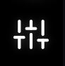

# Project Settings

The Project Settings  sidebar in Chloros allows you to configure all aspects of image processing, calibration target detection, multispectral index calculations, and export options for your project. These settings are saved with your project and can be saved as templates for reuse across multiple projects.

## Accessing Project Settings

To access Project Settings:

1. Open a project in Chloros
2. Click the **Project Settings**   tab in the left sidebar
3. The settings panel will display all available configuration options organized by category

***

## Target Detection

These settings control how Chloros detects and processes calibration targets in your images.

### Minimum calibration sample area (px)

* **Type**: Number
* **Range**: 0 to 10,000 pixels
* **Default**: 25 pixels
* **Description**: Sets the minimum area (in pixels) required for a detected region to be considered a valid calibration target sample. Smaller values will detect smaller targets but may increase false positives. Larger values require bigger, clearer target regions for detection.
* **When to adjust**:
  * Increase if you're getting false detections on small image artifacts
  * Decrease if your calibration targets appear small in your images and are not being detected

### Minimum Target Clustering (0-100)

* **Type**: Number
* **Range**: 0 to 100
* **Default**: 60
* **Description**: Controls the clustering threshold for grouping similar colored regions when detecting calibration targets. Higher values require more similar colors to be grouped together, resulting in more conservative target detection. Lower values allow more color variation within a target group.
* **When to adjust**:
  * Increase if calibration targets are being split into multiple detections
  * Decrease if calibration targets with color variation are not being fully detected

***

## Processing

These settings control how Chloros processes and calibrates your images.

### Vignette correction

* **Type**: Checkbox
* **Default**: Enabled (checked)
* **Description**: Applies vignette correction to compensate for lens darkening at the edges of images. Vignetting is a common optical phenomenon where the corners and edges of an image appear darker than the center due to lens characteristics.
* **When to disable**: Only disable if your camera/lens combination has already applied vignette correction, or if you want to manually correct vignetting in post-processing.

### Reflectance calibration / white balance

* **Type**: Checkbox
* **Default**: Enabled (checked)
* **Description**: Enables automatic reflectance calibration using detected calibration targets in your images. This normalizes the reflectance values across your dataset and ensures consistent measurements regardless of lighting conditions.
* **When to disable**: Disable only if you want to process raw, uncalibrated images or if you're using a different calibration workflow.

### Debayer method

* **Type**: Dropdown selection
* **Options**:
  * High Quality (Faster) - Currently the only option available
* **Default**: High Quality (Faster)
* **Description**: Selects the demosaicing algorithm used to convert raw Bayer pattern sensor data into full-color images. The "High Quality (Faster)" method provides an optimal balance between processing speed and image quality.
* **Note**: Additional debayer methods may be added in future versions of Chloros.

### Minimum recalibration interval

* **Type**: Number
* **Range**: 0 to 3,600 seconds
* **Default**: 0 seconds
* **Description**: Sets the minimum time interval (in seconds) between using calibration targets. When set to 0, Chloros will use every detected calibration target. When set to a higher value, Chloros will only use calibration targets that are separated by at least this many seconds, reducing processing time for datasets with frequent calibration target captures.
* **When to adjust**:
  * Set to 0 for maximum calibration accuracy when lighting conditions vary
  * Increase (e.g., to 60-300 seconds) for faster processing when lighting is consistent and you have frequent calibration target images

### Light sensor timezone offset

* **Type**: Number
* **Range**: -12 to +12 hours
* **Default**: 0 hours
* **Description**: Specifies the timezone offset (in hours from UTC) for light sensor data timestamps. This is used when processing PPK (Post-Processed Kinematic) data files to ensure correct time synchronization between image captures and GPS data.
* **When to adjust**: Set this to your local timezone offset if your PPK data uses local time instead of UTC. For example:
  * Pacific Time: -8 or -7 (depending on DST)
  * Eastern Time: -5 or -4 (depending on DST)
  * Central European Time: +1 or +2 (depending on DST)

### Apply PPK corrections

* **Type**: Checkbox
* **Default**: Disabled (unchecked)
* **Description**: Enables the use of Post-Processed Kinematic (PPK) corrections from MAPIR DAQ recorders containing a GPS (GNSS). When enabled, Chloros will use any .daq log files containing exposure pin data in your project directory and apply precise geolocation corrections to your images.
* **Requirement**: .daq log file with exposure pin entries must be present in your project directory
* **When to enable**: It is recommended to always enable PPK correction if you have exposure feedback entries in your .daq log file.

### Exposure Pin 1

* **Type**: Dropdown selection
* **Visibility**: Only visible when "Apply PPK corrections" is enabled AND exposure data is available for Pin 1
* **Options**:
  * Camera model names detected in the project
  * "Do Not Use" - Ignore this exposure pin
* **Default**: Auto-selected based on project configuration
* **Description**: Assigns a specific camera to Exposure Pin 1 for PPK time synchronization. The exposure pin records the exact timing when the camera shutter is triggered, which is critical for accurate PPK geolocation.
* **Auto-selection behavior**:
  * Single camera + single pin: Automatically selects the camera
  * Single camera + two pins: Pin 1 automatically assigned to the camera
  * Multiple cameras: Manual selection required

### Exposure Pin 2

* **Type**: Dropdown selection
* **Visibility**: Only visible when "Apply PPK corrections" is enabled AND exposure data is available for Pin 2
* **Options**:
  * Camera model names detected in the project
  * "Do Not Use" - Ignore this exposure pin
* **Default**: Auto-selected based on project configuration
* **Description**: Assigns a specific camera to Exposure Pin 2 for PPK time synchronization when using a dual-camera setup.
* **Auto-selection behavior**:
  * Single camera + single pin: Pin 2 automatically set to "Do Not Use"
  * Single camera + two pins: Pin 2 automatically set to "Do Not Use"
  * Multiple cameras: Manual selection required
* **Note**: The same camera cannot be assigned to both Pin 1 and Pin 2 simultaneously.

***

## Index

These settings allow you to configure multispectral indices for analysis and visualization.

### Add index

* **Type**: Special index configuration panel
* **Description**: Opens an interactive panel where you can select and configure multispectral vegetation indices (NDVI, NDRE, EVI, etc.) to calculate during image processing. You can add multiple indices, each with its own visualization settings.
* **Available indices**: The system includes 30+ pre-defined multispectral indices including:
  * NDVI (Normalized Difference Vegetation Index)
  * NDRE (Normalized Difference RedEdge)
  * EVI (Enhanced Vegetation Index)
  * GNDVI, SAVI, OSAVI, MSAVI2
  * And many more (see [Multispectral Index Formulas](multispectral-index-formulas.md) for complete list)
* **Features**:
  * Select from pre-defined index formulas
  * Configure visualization color gradients (LUT - Look-Up Tables)
  * Set threshold values for analysis
  * Create custom index formulas

### Custom Formulas (Chloros+ Feature)

* **Type**: Array of custom formula definitions
* **Description**: Allows you to create and save custom multispectral index formulas using band math. Custom formulas are saved with your project settings and can be used just like built-in indices.
* **How to create**:
  1. In the Index configuration panel, look for the custom formula option
  2. Define your formula using band identifiers (e.g., NIR, Red, Green, Blue)
  3. Save the formula with a descriptive name
* **Formula syntax**: Standard mathematical operations are supported, including:
  * Arithmetic: `+`, `-`, `*`, `/`
  * Parentheses for order of operations
  * Band references: NIR, Red, Green, Blue, RedEdge, Cyan, Orange, NIR1, NIR2

***

## Export

These settings control the format and quality of exported processed images.

### Calibrated image format

* **Type**: Dropdown selection
* **Options**:
  * **TIFF (16-bit)** - Uncompressed 16-bit TIFF format
  * **TIFF (32-bit, Percent)** - 32-bit floating-point TIFF with reflectance values as percentages
  * **PNG (8-bit)** - Compressed 8-bit PNG format
  * **JPG (8-bit)** - Compressed 8-bit JPEG format
* **Default**: TIFF (16-bit)
* **Description**: Selects the file format for saving processed and calibrated images.
* **Format recommendations**:
  * **TIFF (16-bit)**: Recommended for scientific analysis and professional workflows. Preserves maximum data quality with no compression artifacts. Best for multispectral analysis and further processing in GIS software.
  * **TIFF (32-bit, Percent)**: Best for workflows that require reflectance values as percentages (0-100%). Offers maximum precision for radiometric measurements.
  * **PNG (8-bit)**: Good for web viewing and general visualization. Smaller file sizes with lossless compression, but reduced dynamic range.
  * **JPG (8-bit)**: Smallest file sizes, best for previews and web display only. Uses lossy compression which is not suitable for scientific analysis.

***

## Save Project Template

This feature allows you to save your current project settings as a reusable template.

* **Type**: Text input + Save button
* **Description**: Enter a descriptive name for your settings template and click the save icon. The template will store all your current project settings (target detection, processing options, indices, and export format) for easy reuse in future projects.
* **Use cases**:
  * Create templates for different camera systems (RGB, multispectral, NIR)
  * Save standard configurations for specific crop types or analysis workflows
  * Share consistent settings across a team
* **How to use**:
  1. Configure all your desired project settings
  2. Enter a template name (e.g., "RedEdge Survey3 NDVI Standard")
  3. Click the save icon
  4. The template can now be loaded when creating new projects

***

## Save Project Folder

This setting specifies where new projects are saved by default.

* **Type**: Directory path display + Edit button
* **Default**: `C:\Users\[Username]\Chloros Projects`
* **Description**: Shows the current default directory where new Chloros projects are created. Click the edit icon to select a different directory.
* **When to change**:
  * Set to a network drive for team collaboration
  * Change to a drive with more storage space for large datasets
  * Organize projects by year, client, or project type in different folders
* **Note**: Changing this setting only affects NEW projects. Existing projects remain in their original locations.

***

## Settings Persistence

All project settings are automatically saved with your project file (`.mapir` project format). When you reopen a project, all settings are restored exactly as you left them.

### Settings Hierarchy

Settings are applied in the following order:

1. **System defaults** - Built-in defaults defined by Chloros
2. **Template settings** - If you load a template when creating a project
3. **Saved project settings** - Settings saved with the project file
4. **Manual adjustments** - Any changes you make during the current session

### Settings and Image Processing

Most settings changes (especially in Processing and Export categories) will trigger reprocessing of images to reflect the new settings. However, some settings are "export-only" and don't require immediate reprocessing:

* Save Project Template
* Working Directory
* Calibrated image format (applies when exporting)

***

## Best Practices

1. **Start with defaults**: The default settings work well for most MAPIR camera systems and typical workflows.
2. **Create templates**: Once you've optimized settings for a specific workflow or camera, save them as a template to ensure consistency across projects.
3. **Test before full processing**: When experimenting with new settings, test on a small subset of images before processing your entire dataset.
4. **Document your settings**: Use descriptive template names that indicate the camera system, processing type, and intended use (e.g., "Survey3\_RGB\_NDVI\_Agriculture").
5. **Export format selection**: Choose your export format based on your end use:
   * Scientific analysis → TIFF (16-bit or 32-bit)
   * GIS processing → TIFF (16-bit)
   * Quick visualization → PNG (8-bit)
   * Web sharing → JPG (8-bit)

***

For more information on multispectral indices in Chloros, see [Multispectral Index Formulas](multispectral-index-formulas.md) page.
