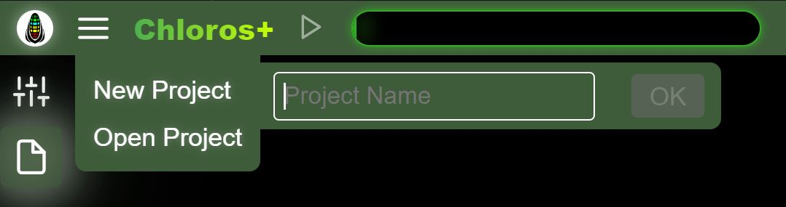
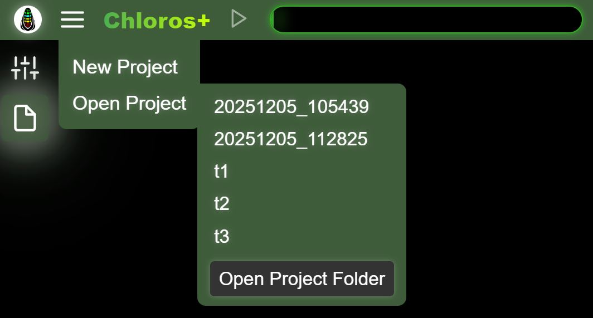

# 图形用户界面：项目

Chloros 允许您创建项目，这些项目可在未来重新打开。

## 新建项目

<figure><figcaption></figcaption></figure>从主菜单选择&quot;新建项目&quot;，并为项目输入唯一名称。

## 打开项目

<figure><figcaption></figcaption></figure>选择&quot;打开项目&quot;可查看项目文件夹中的现有项目列表。若无项目存在，侧边菜单将不会展开。如上图所示，您可看到若干由GUI创建的项目（t1、t2、t3）。DATE\_TIME系列项目由CLI采用默认命名规则生成。点击任意项目名称即可打开。

点击&quot;打开项目文件夹&quot;按钮将打开计算机文件资源管理器并定位至项目路径。您可在[项目设置](project-settings/project-settings.md)中调整项目路径。
